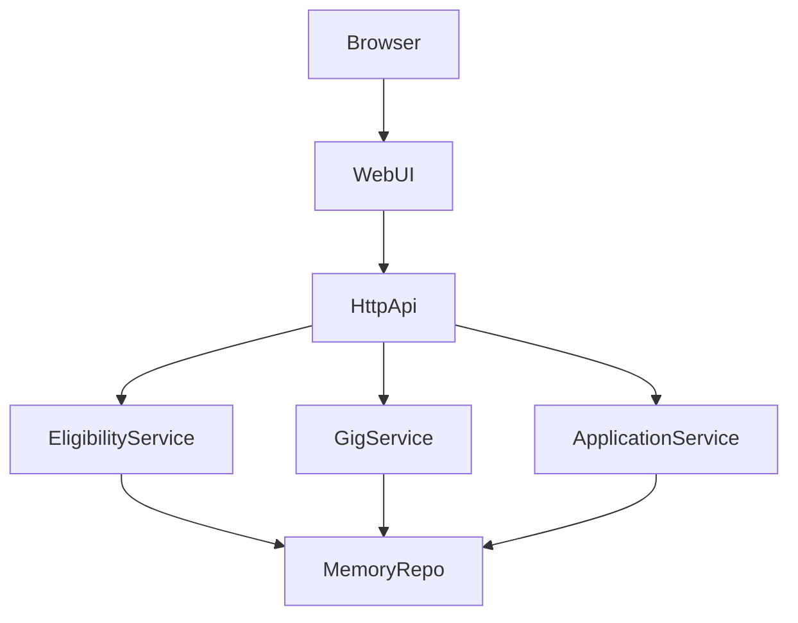
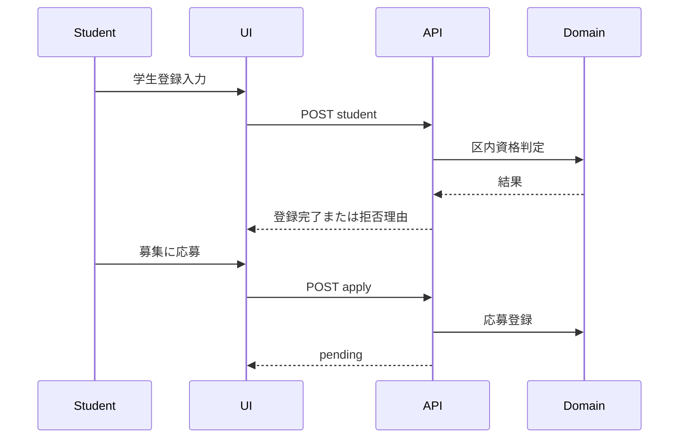

# Design Document

## Overview

本機能は、豊島区内限定の学生短時間タスクマッチングをMVPとして提供する。学生と事業者の登録時点で区内要件を強制し、30〜120分の軽作業募集を安全に扱う。

利用者は「学生」「事業者」の2種で、学生は募集閲覧・応募、事業者は募集作成・応募採用を行う。現金と非金銭報酬の双方を扱い、地域の実情に合わせた依頼設計を可能にする。

### Goals
- 区内対象者のみが参加する仕組みをサーバ側で保証する
- 30〜120分の短時間募集を迷わず投稿・閲覧できる
- 応募から採用までを最小手数で完結できる

### Non-Goals
- 本人確認書類の厳格審査
- 決済連携
- チャット機能

## Architecture

### Architecture Pattern & Boundary Map

**Architecture Integration**:
- Selected pattern: レイヤードモノリス（UI/API/Domain/Repository）
- Domain boundaries: 利用資格、募集管理、応募管理を分離
- Existing patterns preserved: 依存最小のNode標準構成
- New components rationale: 仕様トレーサビリティを保つため各ドメインサービスを分離
- Steering compliance: `.kiro/steering` の責務分離規約を維持



### Technology Stack

| Layer | Choice / Version | Role in Feature | Notes |
|-------|------------------|-----------------|-------|
| Frontend / CLI | HTML CSS JavaScript | 登録、募集作成、応募操作 | 依存なし |
| Backend / Services | Node.js 20 HTTP | API提供とドメイン呼び出し | 依存なし |
| Data / Storage | In memory + JSON seed | MVPデータ保持 | 再起動で初期化 |
| Infrastructure / Runtime | npm scripts | 起動とテスト | 開発コスト最小化 |

## System Flows



Key decisions:
- 資格判定はUIではなくDomainで最終確定する
- 応募状態は `pending` と `accepted` の2状態に限定する

## Requirements Traceability

| Requirement | Summary | Components | Interfaces | Flows |
|-------------|---------|------------|------------|-------|
| 1.1, 1.2, 1.3 | 学生資格判定 | EligibilityService | POST `/api/students` | 登録フロー |
| 2.1, 2.2, 2.3 | 事業者資格判定 | EligibilityService | POST `/api/providers` | 登録フロー |
| 3.1, 3.2, 3.3 | 募集作成と公開 | GigService | POST `/api/gigs`, GET `/api/gigs` | 募集作成 |
| 4.1, 4.2, 4.3 | 報酬二系統 | GigService | POST `/api/gigs` | 募集作成 |
| 5.1, 5.2, 5.3 | 応募採用 | ApplicationService | POST `/api/gigs/:id/apply`, POST `/api/applications/:id/accept` | 応募採用 |
| 6.1, 6.2, 6.3 | 募集閲覧導線 | GigService, WebUI | GET `/api/gigs?category=` | 一覧閲覧 |

## Components and Interfaces

| Component | Domain/Layer | Intent | Req Coverage | Key Dependencies | Contracts |
|-----------|--------------|--------|--------------|------------------|-----------|
| EligibilityService | Domain | 学生/事業者資格判定 | 1.1, 1.2, 1.3, 2.1, 2.2, 2.3 | MemoryRepo P0 | Service |
| GigService | Domain | 募集作成/検索 | 3.1, 3.2, 3.3, 4.1, 4.2, 4.3, 6.1, 6.2, 6.3 | MemoryRepo P0 | Service |
| ApplicationService | Domain | 応募/採用管理 | 5.1, 5.2, 5.3 | MemoryRepo P0 | Service |
| HttpApi | Interface | REST API公開 | 1.1-6.3 | 各Service P0 | API |
| WebUI | Interface | ユーザー操作画面 | 3.3, 6.1, 6.2, 6.3 | HttpApi P0 | State |

### Domain Layer

#### EligibilityService

| Field | Detail |
|-------|--------|
| Intent | 豊島区内資格の判定と登録 |
| Requirements | 1.1, 1.2, 1.3, 2.1, 2.2, 2.3 |

**Responsibilities & Constraints**
- 学生種別を `highschool` `university` のみに制限
- 事業者種別を `sole_proprietor` `community_facility` のみに制限
- 区名は `豊島区` 完全一致を必須化

##### Service Interface
```typescript
interface EligibilityService {
  registerStudent(input: StudentInput): Result<Student, DomainError>;
  registerProvider(input: ProviderInput): Result<Provider, DomainError>;
}
```

#### GigService

| Field | Detail |
|-------|--------|
| Intent | 募集作成と一覧表示 |
| Requirements | 3.1, 3.2, 3.3, 4.1, 4.2, 4.3, 6.1, 6.2, 6.3 |

**Responsibilities & Constraints**
- 時間は15〜120分に制約
- 報酬種別ごとの必須項目を分岐検証
- 一覧は公開中のみ、最新順返却

##### Service Interface
```typescript
interface GigService {
  createGig(input: GigInput): Result<Gig, DomainError>;
  listOpenGigs(filter: GigFilter): Gig[];
}
```

#### ApplicationService

| Field | Detail |
|-------|--------|
| Intent | 応募と採用状態管理 |
| Requirements | 5.1, 5.2, 5.3 |

**Responsibilities & Constraints**
- 応募初期状態は `pending`
- 採用は1募集1件まで
- 採用済み募集への追加採用は禁止

##### Service Interface
```typescript
interface ApplicationService {
  applyToGig(input: ApplyInput): Result<Application, DomainError>;
  acceptApplication(applicationId: string): Result<Application, DomainError>;
}
```

### Interface Layer

#### HttpApi

##### API Contract
| Method | Endpoint | Request | Response | Errors |
|--------|----------|---------|----------|--------|
| POST | /api/students | StudentInput | Student | 400, 422 |
| POST | /api/providers | ProviderInput | Provider | 400, 422 |
| POST | /api/gigs | GigInput | Gig | 400, 422 |
| GET | /api/gigs | category optional | GigList | 200 |
| POST | /api/gigs/:id/apply | studentId | Application | 404, 409, 422 |
| POST | /api/applications/:id/accept | none | Application | 404, 409 |

## Data Models

### Domain Model

- Student: `id`, `name`, `schoolType`, `schoolName`, `ward`
- Provider: `id`, `name`, `providerType`, `ward`
- Gig: `id`, `providerId`, `title`, `description`, `category`, `durationMinutes`, `reward`, `status`, `createdAt`
- Application: `id`, `gigId`, `studentId`, `status`, `createdAt`

### Logical Data Model

- Student 1:N Application
- Provider 1:N Gig
- Gig 1:N Application
- Gig `status=open` かつ `acceptedApplicationId` null のとき応募可能

## Error Handling

### Error Strategy

- 入力欠落は `400`
- 業務ルール違反は `422`
- 重複採用や状態競合は `409`
- 未存在IDは `404`

### Monitoring

- MVPでは構造化ログ（timestamp, route, status, message）を標準出力へ出す

## Testing Strategy

- Unit Tests
  - 区内判定
  - 学生/事業者種別判定
  - 報酬種別判定
  - 時間範囲判定
  - 採用重複防止
- Integration Tests
  - 学生登録から応募まで
  - 事業者登録から募集作成まで
  - 応募採用APIフロー
- E2E/UI Tests
  - 最低限の手動確認（登録、一覧、応募）
